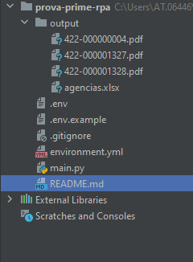

# Projeto teste de RPA

## ☤ Requisitos

* [Anaconda](https://docs.anaconda.com/anaconda/user-guide/getting-started/)
* [Google Chrome](https://www.google.com/chrome)

## ☤ Criar env do conda

Criar o env com base no arquivo do projeto

```
  $ conda env create -f environment.yml --force
```

Ativar env criado

```
  $ conda activate rpa
```

## ☤ Arquivo de config .env do projeto

Para rodar configurações personalizadas é possivel ajustar as constantes utilizadas no projeto

Ex:

```
# Development settings
DOMAIN=https://itdashboard.gov/
EXCEL=agencias.xlsx
OUTPUT=output
AGENCIA=National Science Foundation
```

## ☤ Run application

```
  $ python .\main.py
```

## ☤ Estrutura



